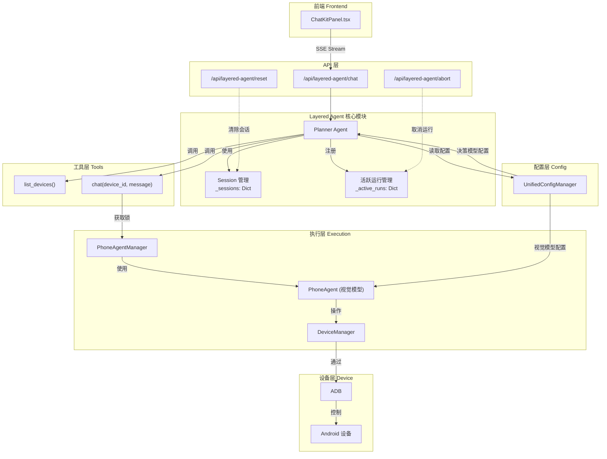
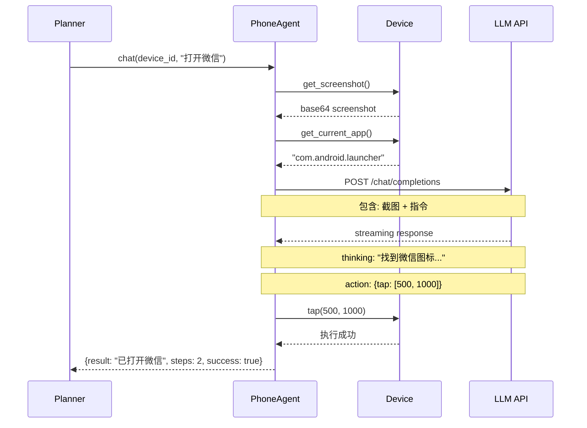
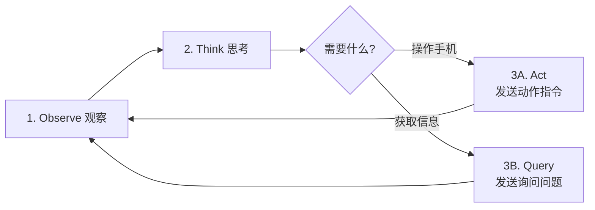
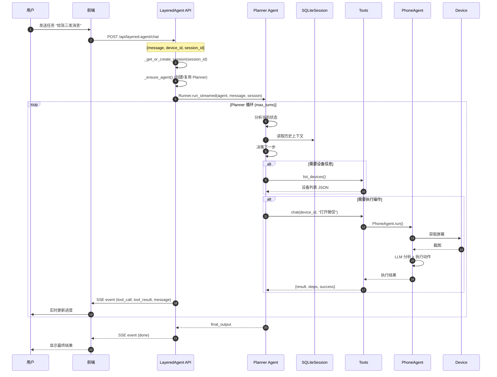
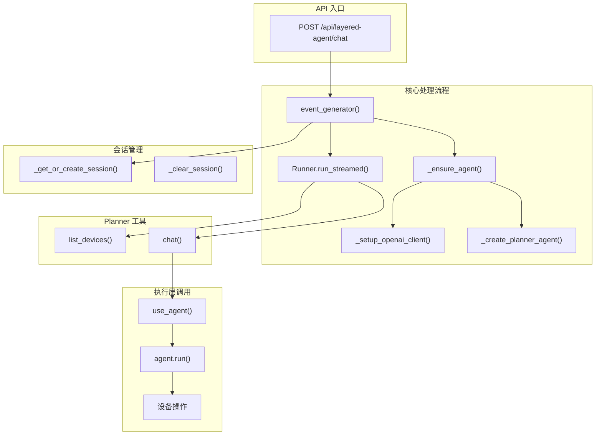
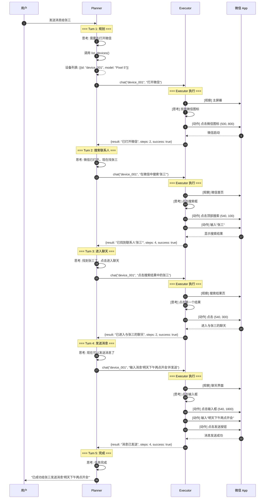

# Layered Agent 原理分析文档

## 目录

1. [概述](#概述)
2. [核心架构](#核心架构)
3. [分层设计原理](#分层设计原理)
4. [数据流与调用图](#数据流与调用图)
5. [实现细节](#实现细节)
6. [模拟任务案例](#模拟任务案例)
7. [配置与扩展](#配置与扩展)

---

## 概述

### 什么是 Layered Agent？

Layered Agent（分层代理）是一种**分层式任务执行架构**，通过将复杂的任务拆分为两层来处理：

```
┌─────────────────────────────────────────────────────────────┐
│                     用户请求                                  │
│              "帮我打开微信并给张三发消息"                        │
└─────────────────────────────────────────────────────────────┘
                              ↓
┌─────────────────────────────────────────────────────────────┐
│                   决策层 (Planner)                            │
│  • 使用决策模型（支持 OpenAI 兼容接口）                          │
│  • 负责任务规划、步骤分解、决策制定                             │
│  • 工具：list_devices(), chat()                               │
└─────────────────────────────────────────────────────────────┘
                              ↓
┌─────────────────────────────────────────────────────────────┐
│                   执行层 (Executor)                           │
│  • 使用视觉模型（如 AutoGLM-Phone）                           │
│  • 负责屏幕理解、UI 操作执行                                   │
│  • 能力：点击、滑动、输入、截图观察                            │
└─────────────────────────────────────────────────────────────┘
                              ↓
┌─────────────────────────────────────────────────────────────┐
│                      Android 设备                             │
│                  (实际操作发生的地方)                          │
└─────────────────────────────────────────────────────────────┘
```

### 核心设计理念

1. **关注点分离**：决策层负责"想什么"，执行层负责"怎么做"
2. **能力边界明确**：决策层知道执行层的限制，不会下达无法执行的指令
3. **原子化操作**：每个子任务都是独立的、可观察的
4. **会话持久化**：通过 SQLiteSession 保持上下文记忆

---

## 核心架构

### 系统架构图



### 核心组件说明

| 组件 | 文件位置 | 职责 |
|------|----------|------|
| **Layered Agent API** | `api/layered_agent.py` | API 路由、SSE 流式响应 |
| **Planner Agent** | `api/layered_agent.py` | 决策层代理，使用 openai-agents SDK |
| **Session Manager** | `api/layered_agent.py` | SQLiteSession 会话管理 |
| **Tools** | `api/layered_agent.py` | list_devices, chat 函数工具 |
| **PhoneAgentManager** | `phone_agent_manager.py` | 执行层代理生命周期管理 |
| **AsyncGLMAgent** | `agents/glm/async_agent.py` | 异步视觉模型执行 |
| **ConfigManager** | `config_manager.py` | 四层配置管理 |

---

## 分层设计原理

### 决策层 (Planner Layer)

**核心能力：**
- 任务理解与拆解
- 策略规划
- 工具调用决策
- 结果验证与调整

**关键限制（来自 PLANNER_INSTRUCTIONS）：**

```python
# 决策层知道执行层的这些限制：
1. 执行层没有"记忆/笔记"功能 → 必须通过对话获取信息
2. 执行层无"系统级"权限 → 不能直接操作剪贴板、复制文本
3. 执行层只能"看"和"做" → 观察屏幕、点击/滑动操作
```

**Planner 的工具集：**

```python
@function_tool
async def list_devices() -> str:
    """获取所有连接的 ADB 设备列表"""
    # 返回设备信息: id, model, status, connection_type

@function_tool
async def chat(device_id: str, message: str) -> str:
    """
    向指定设备的 Phone Agent 发送子任务指令

    Args:
        device_id: 设备标识符
        message: 子任务指令（如 "打开微信"、"点击搜索按钮"）

    Returns:
        执行结果: {result, steps, success}
    """
```

### 执行层 (Executor Layer)

**核心能力：**
- 屏幕视觉理解（Vision Model）
- UI 元素定位与操作
- 状态观察与反馈

**执行流程（每次 chat 调用）：**



**执行层限制（MCP_MAX_STEPS = 5）：**

```python
# 每次调用最多执行 5 步，防止执行层陷入死循环
MCP_MAX_STEPS = 5

# 如果达到步数限制，返回详细上下文供 Planner 重新规划
if steps >= MCP_MAX_STEPS:
    return {
        "result": "⚠️ 已达到最大步数限制...",
        "steps": MCP_MAX_STEPS,
        "success": False,
    }
```

### 两层交互模式

**Observe-Think-Act 循环：**



**示例对话：**

```
# 用户："获取当前页面的标题"

# Planner 思考：
# - 执行层无法直接提取文本
# - 必须通过询问让执行层"读"出来

# Planner → Executor:
chat(device_id, "请读取并告诉我屏幕上这篇笔记的标题文字内容是什么？")

# Executor (观察屏幕，识别文字):
# "标题是：《2024年终总结》"

# Planner → 用户:
# "当前页面的标题是《2024年终总结》"
```

---

## 数据流与调用图

### 完整请求流程



### 函数调用关系图



### 数据结构流转

**1. 请求数据结构：**

```python
class LayeredAgentRequest(BaseModel):
    message: str           # 用户任务描述
    device_id: str | None  # 目标设备 ID
    session_id: str | None # 会话 ID（用于上下文保持）
```

**2. SSE 事件类型：**

```python
# 工具调用事件
{
    "type": "tool_call",
    "tool_name": "chat",
    "tool_args": {"device_id": "ABC123", "message": "打开微信"}
}

# 工具结果事件
{
    "type": "tool_result",
    "tool_name": "chat",
    "result": "已打开微信"
}

# 中间消息事件
{
    "type": "message",
    "content": "正在为您打开微信..."
}

# 完成事件
{
    "type": "done",
    "content": "任务完成",
    "success": true
}

# 错误事件
{
    "type": "error",
    "message": "错误描述"
}
```

**3. chat 工具返回数据结构：**

```python
# 成功情况
{
    "result": "已打开微信",
    "steps": 3,
    "success": true
}

# 步数超限
{
    "result": "⚠️ 已达到最大步数限制（5步）",
    "steps": 5,
    "success": false
}

# 设备忙
{
    "result": "设备 ABC123 正忙，请稍后再试",
    "steps": 0,
    "success": false
}
```

---

## 实现细节

### 1. Session 管理

```python
# 内存模式 SQLiteSession
_sessions: dict[str, SQLiteSession] = {}

def _get_or_create_session(session_id: str) -> SQLiteSession:
    """获取或创建会话，自动保持上下文"""
    if session_id not in _sessions:
        _sessions[session_id] = SQLiteSession(session_id)
    return _sessions[session_id]
```

**Session 持久化机制：**
- 使用 openai-agents SDK 的 `SQLiteSession`
- 存储完整的对话历史（user messages, assistant responses, tool calls）
- 跨请求保持上下文，支持多轮对话

### 2. 活跃运行管理

```python
_active_runs: dict[str, "RunResultStreaming"] = {}
_active_runs_lock = threading.Lock()

# 注册活跃运行
with _active_runs_lock:
    _active_runs[session_id] = result

# 取消运行
result.cancel(mode="immediate")
```

**支持中断机制：**
- 存储活跃的 `RunResultStreaming` 实例
- 通过 `/api/layered-agent/abort` 端点取消运行
- 使用 SDK 的 `cancel(mode="immediate")` 立即中断

### 3. 配置热重载

```python
# 配置变更检测
_cached_config_hash: str | None = None

def _compute_config_hash() -> str:
    config = config_manager.get_effective_config()
    config_str = config.model_dump_json()
    return hashlib.md5(config_str.encode()).hexdigest()

def _ensure_agent() -> Agent[Any]:
    current_hash = _compute_config_hash()
    if _agent is None or _cached_config_hash != current_hash:
        # 配置变更，重新创建 Agent
        _client = _setup_openai_client()
        _agent = _create_planner_agent(_client)
        _cached_config_hash = current_hash
```

**四层配置优先级：**
```
CLI 参数 > 环境变量 > 配置文件 > 默认值
```

### 4. 并发控制

```python
# PhoneAgentManager 的设备级锁
_device_locks: dict[str, threading.Lock] = {}

@contextmanager
def use_agent(self, device_id: str, timeout: float = None):
    """上下文管理器，自动获取/释放设备锁"""
    lock = self._get_device_lock(device_id)
    lock.acquire()  # 获取锁
    try:
        yield self.get_agent(device_id)
    finally:
        lock.release()  # 确保释放
```

**并发安全机制：**
- 设备级锁：防止同一设备并发执行
- 线程安全：使用 RLock 保护内部状态
- 超时控制：支持锁获取超时

### 5. 流式事件处理

```python
async for event in result.stream_events():
    if isinstance(event, RunItemStreamEvent):
        item_type = event.item.type

        if item_type == "tool_call_item":
            # 提取工具名称和参数
            tool_name = extract_tool_name(event.item)
            tool_args = extract_tool_args(event.item)
            yield f"data: {json.dumps({'type': 'tool_call', ...})}\n\n"

        elif item_type == "tool_call_output_item":
            # 提取工具结果
            output = event.item.output
            yield f"data: {json.dumps({'type': 'tool_result', ...})}\n\n"

        elif item_type == "message_output_item":
            # 提取消息内容
            content = extract_content(event.item)
            yield f"data: {json.dumps({'type': 'message', ...})}\n\n"
```

---

## 模拟任务案例

### 场景：发送微信消息给联系人

**用户请求：**
```
"帮我打开微信，找到张三，发送消息'明天下午两点开会'"
```

### 完整执行流程



### 实际代码执行示例

**Turn 1: 打开微信**

```python
# Planner 决策
{
    "tool": "chat",
    "arguments": {
        "device_id": "device_001",
        "message": "打开微信"
    }
}

# Executor 执行步骤
Step 1:
  thinking: "我看到主屏幕，需要找到微信图标"
  action: {"type": "do", "operation": "tap", "coordinates": [500, 800]}

Step 2:
  thinking: "微信已启动，正在加载..."
  action: {"type": "finish", "message": "已打开微信"}

# 返回结果
{
    "result": "已打开微信",
    "steps": 2,
    "success": true
}
```

**Turn 2: 搜索联系人**

```python
# Planner 决策
{
    "tool": "chat",
    "arguments": {
        "device_id": "device_001",
        "message": "在微信中搜索'张三'"
    }
}

# Executor 执行步骤
Step 1:
  thinking: "看到微信首页，点击顶部搜索框"
  action: {"type": "do", "operation": "tap", "coordinates": [540, 100]}

Step 2:
  thinking: "搜索框已激活，输入'张三'"
  action: {"type": "do", "operation": "type", "text": "张三"}

Step 3:
  thinking: "等待搜索结果..."
  action: {"type": "wait", "duration": 1000}

Step 4:
  thinking: "看到搜索结果，找到'张三'"
  action: {"type": "finish", "message": "已找到联系人'张三'"}

# 返回结果
{
    "result": "已找到联系人'张三'",
    "steps": 4,
    "success": true
}
```

### 关键决策点分析

| 决策点 | Planner 思考过程 | Executor 行动 |
|--------|------------------|---------------|
| **第一步做什么** | 需要先打开微信，才能发消息 | chat("打开微信") |
| **如何找到张三** | 微信有搜索功能，搜索最快 | chat("搜索'张三'") |
| **获取验证码** | Executor 不能提取文本，必须问 | chat("告诉我验证码是多少？") |
| **复制链接** | Executor 不能操作剪贴板 | chat("长按链接，点击复制按钮") |

---

## 配置与扩展

### 配置项说明

```json
{
  // 视觉模型配置（执行层）
  "base_url": "https://open.bigmodel.cn/api/paas/v4",
  "model_name": "autoglm-phone-9b",
  "api_key": "sk-xxxxx",

  // 决策模型配置（决策层）
  "decision_base_url": "https://api.example.com/v1",
  "decision_model_name": "decision-model-name",
  "decision_api_key": "sk-xxxxx",

  // 执行参数
  "default_max_steps": 100,
  "layered_max_turns": 50
}
```

### 自定义 Planner 提示词

修改 `PLANNER_INSTRUCTIONS` 可以定制决策层行为：

```python
PLANNER_INSTRUCTIONS = """
## 核心目标
你是一个负责操控手机的高级智能中枢。

## 你的下级能力边界
- 无记忆功能：不能保存变量
- 无系统权限：不能直接操作剪贴板
- 唯一输出：只能操作屏幕或回答问题

## 交互策略
1. 操作手机：下达明确的 UI 动作指令
2. 获取信息：通过提问让执行层"念"出来
3. 复制粘贴：通过模拟手指操作实现

## 工具集
- list_devices(): 获取设备列表
- chat(device_id, message): 发送子任务
"""
```

### 添加新工具

```python
@function_tool
async def get_battery_info(device_id: str) -> str:
    """获取设备电池信息"""
    # 实现电池查询逻辑
    return json.dumps({"level": 85, "charging": False})

# 在创建 Agent 时添加
agent = Agent(
    name="Planner",
    instructions=PLANNER_INSTRUCTIONS,
    model=model,
    tools=[list_devices, chat, get_battery_info]  # 添加新工具
)
```

### 扩展执行层能力

```python
# 在 AsyncGLMAgent 中添加新的 action 类型
class ActionHandler:
    def execute(self, action: dict, width: int, height: int) -> ActionResult:
        action_type = action.get("type")

        if action_type == "tap":
            return self._execute_tap(action, width, height)
        elif action_type == "swipe":
            return self._execute_swipe(action, width, height)
        elif action_type == "type":
            return self._execute_type(action)
        elif action_type == "screenshot":  # 新增
            return self._execute_screenshot(action)
        else:
            raise ValueError(f"Unknown action type: {action_type}")
```

---

## 总结

### Layered Agent 的优势

1. **清晰的责任划分**：决策层负责"想"，执行层负责"做"
2. **可扩展性强**：可以独立优化任一层
3. **调试友好**：每层的输出都是可观察的
4. **容错性好**：执行层失败后，决策层可以重新规划

### 关键设计原则

| 原则 | 说明 | 实现 |
|------|------|------|
| **能力边界明确** | 决策层知道执行层能做什么/不能做什么 | PLANNER_INSTRUCTIONS |
| **原子化操作** | 每个子任务独立、可观察 | MCP_MAX_STEPS=5 |
| **会话持久化** | 保持上下文，支持多轮对话 | SQLiteSession |
| **流式反馈** | 实时推送执行进度 | SSE events |
| **可中断** | 支持用户随时取消任务 | cancel(mode="immediate") |

### 最佳实践

1. **合理设置 layered_max_turns**：复杂任务可能需要更多轮次
2. **清晰的用户指令**：避免模糊的描述
3. **监控执行步数**：频繁达到步数限制说明任务拆分不够细致
4. **利用会话机制**：相关任务使用同一 session_id
